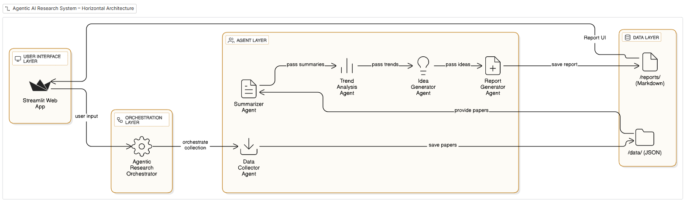

# Agentic AI Research System

**Agentic AI Research System** là một công cụ Python tự động hóa quy trình nghiên cứu khoa học trong lĩnh vực *Agentic AI*.
Hệ thống này thu thập, tóm tắt, phân tích xu hướng và đề xuất ý tưởng nghiên cứu dựa trên các bài báo khoa học từ **ArXiv** và **Semantic Scholar**.

---

## 1. Giới thiệu

Dự án này mô phỏng một **AI Research Assistant** có khả năng:

* Thu thập dữ liệu nghiên cứu mới nhất từ nhiều nguồn mở.
* Tự động tóm tắt nội dung bài báo.
* Phân tích xu hướng và trích xuất từ khóa quan trọng.
* Đề xuất ý tưởng nghiên cứu tiềm năng dựa trên dữ liệu thu thập được.
* Tạo **báo cáo Markdown** chuyên nghiệp để tổng hợp và trình bày kết quả nghiên cứu.

---

## 2. Kiến trúc hệ thống

Hệ thống được thiết kế theo **mô hình đa tác nhân (Multi-Agent Architecture)**, trong đó mỗi *agent* đảm nhận một vai trò cụ thể trong pipeline R&D tự động.

| Tác nhân                        | Vai trò                                                         |
| ------------------------------- | --------------------------------------------------------------- |
| **DataCollectorAgent**          | Thu thập papers từ ArXiv và Semantic Scholar                    |
| **SummarizerAgent**             | Tóm tắt văn bản bằng phương pháp extractive summarization       |
| **TrendAnalysisAgent**          | Phân tích xu hướng, trích xuất từ khóa và cụm từ quan trọng     |
| **IdeaGeneratorAgent**          | Tạo ý tưởng nghiên cứu mới dựa trên xu hướng và từ khóa nổi bật |
| **ReportGeneratorAgent**        | Sinh báo cáo tổng hợp (Markdown)                                |
| **AgenticResearchOrchestrator** | Điều phối toàn bộ pipeline từ thu thập đến báo cáo              |

**Sơ đồ kiến trúc hệ thống :**

```

```

---

## 3. Cấu trúc thư mục

```
agentic_ai_research/
│
├── main.py              # Mã nguồn chính
├── data/                # Nơi lưu papers đã thu thập (JSON)
├── reports/             # Báo cáo Markdown được sinh tự động
└── requirements.txt     # (Tùy chọn) Danh sách thư viện cần cài đặt
```

---

## 4. Cài đặt

### Yêu cầu

* Python 3.9+
* Internet để truy cập ArXiv và Semantic Scholar API

### Cài đặt thư viện

```bash
pip install arxiv requests
```

---

## 5. Cách sử dụng

Chạy pipeline nghiên cứu tự động với lệnh:

```bash
python main.py
```

Cấu hình mặc định trong `main()`:

* Từ khóa tìm kiếm: `"Agentic AI OR AI Agents OR Autonomous AI"`
* Thời gian: 30 ngày gần nhất
* Số lượng papers tối đa: 50

Khi chạy xong, hệ thống sẽ:

1. Thu thập dữ liệu từ ArXiv và Semantic Scholar
2. Tóm tắt nội dung bài báo
3. Phân tích xu hướng nghiên cứu
4. Tạo ý tưởng nghiên cứu mới
5. Xuất báo cáo Markdown trong thư mục `reports/`

---

## 6. Đầu ra

Ví dụ báo cáo sinh ra tự động:

```
reports/research_report_20251022_153045.md
```

Báo cáo bao gồm:

* Tổng hợp số lượng bài báo
* Từ khóa và cụm từ nổi bật
* Phân tích chủ đề nghiên cứu
* Đề xuất ý tưởng nghiên cứu
* Danh sách bài báo mới nhất kèm tóm tắt

---

## 7. Hướng phát triển

* Tích hợp mô hình LLM để tóm tắt ngữ nghĩa sâu hơn.
* Bổ sung giao diện web trực quan (Streamlit hoặc FastAPI).
* Mở rộng phân tích xu hướng theo từng lĩnh vực cụ thể.

---
